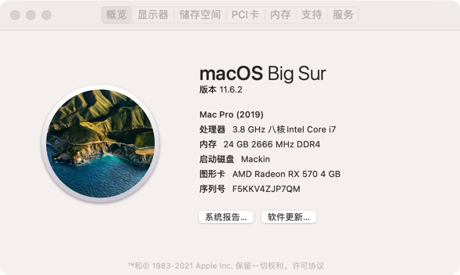

# Hackintosh for i7 10700kf

This EFI aims to work with `macOS bigsur` now. Stay tuned :)

| Properties   | Detail                       | Works? |
|--------------|------------------------------|------|
| CPU          | INTEL i7 10700KF             | YES  |
| Memory       | 16G                          | YES  |
| GPU          | RX580 2048sp(vbios to RX570) | YES  |
| Sound        | ALC1227                      | NO   |
| HDMI         | RX570                        | YES  |
| Network Card | AX201 WiFi6                  | YES  |
| iCloud       | Sync                         | YES  |
| Bluetooth    | AX200 WiFi6                  | YES  |
| Board        | 华硕z490A                      | YES  |

## Credits

- Apple for macOS
